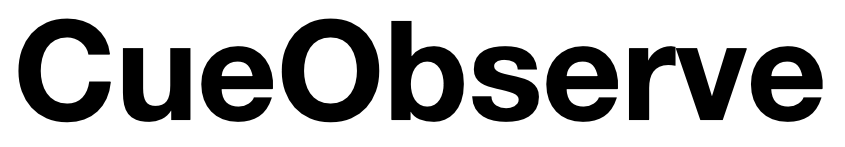

# Overview

[](https://cueobserve.cuebook.ai)

[](https://codeclimate.com/github/cuebook/CueObserve/maintainability) [](https://codeclimate.com/github/cuebook/CueObserve/test\_coverage) [ ](https://github.com/cuebook/cueobserve/actions/workflows/pr\_checks.yml)[](https://github.com/cuebook/cueobserve/blob/main/LICENSE.md)


CueObserve helps you monitor your metrics. Know when, where, and why a metric isn't right.

CueObserve uses **timeseries Anomaly detection** to find **where** and **when** a metric isn't right. It then offers **one-click Root Cause analysis** so that you know **why** a metric isn't right.

CueObserve works with data in your SQL data warehouses and databases. It currently supports Snowflake, BigQuery, Redshift, Druid, Pinot, Postgres, MySQL, SQL Server and ClickHouse.

.png>) .png>)

### Getting Started

Install via Docker

```
wget https://raw.githubusercontent.com/cuebook/CueObserve/latest_release/docker-compose.yml -q -O cueobserve-docker-compose.yml
docker-compose -f cueobserve-docker-compose.yml up -d
```

Now visit [http://localhost:3000](http://localhost:3000) in your browser.

### Demo Video

[](http://www.youtube.com/watch?feature=player\_embedded\&v=VZvgNa65GQU)

### How it works

You write a SQL GROUP BY query, map its columns as dimensions and measures, and save it as a virtual Dataset.

.png>)

.png>)

You then define one or more anomaly detection jobs on the dataset.

.png>)

When an anomaly detection job runs, CueObserve does the following:

1. Executes the SQL GROUP BY query on your data warehouse and stores the result as a Pandas dataframe.
2. Generates one or more timeseries from the dataframe, as defined in your anomaly detection job.
3. Generates a forecast for each timeseries using [Prophet](https://github.com/facebook/prophet).
4. Creates a visual card for each timeseries. Marks the card as an anomaly if the last data point is anomalous.

### Features

* Automated SQL to timeseries transformation.
* Run anomaly detection on the aggregate metric or split it by any dimension. Limit the split to significant dimension values.
* Use Prophet or simple mathematical rules to detect anomalies.
* In-built Scheduler. CueObserve uses Celery as the executor and celery-beat as the scheduler.
* Slack alerts when anomalies are detected.
* Monitoring. Slack alert when a job fails. CueObserve maintains detailed logs.

#### Limitations

* Currently supports Prophet for timeseries forecasting.
* Not being built for real-time anomaly detection on streaming data.

### Support

For general help using CueObserve, read the [documentation](https://cueobserve.cuebook.ai), or go to [Github Discussions](https://github.com/cuebook/cueobserve/discussions).

To report a bug or request a feature, open an [issue](https://github.com/cuebook/cueobserve/issues).

### Contributing

We'd love contributions to CueObserve. Before you contribute, please first discuss the change you wish to make via an [issue](https://github.com/cuebook/cueobserve/issues) or a [discussion](https://github.com/cuebook/cueobserve/discussions). Contributors are expected to adhere to our [code of conduct](https://github.com/cuebook/cueobserve/blob/main/CODE\_OF\_CONDUCT.md).
