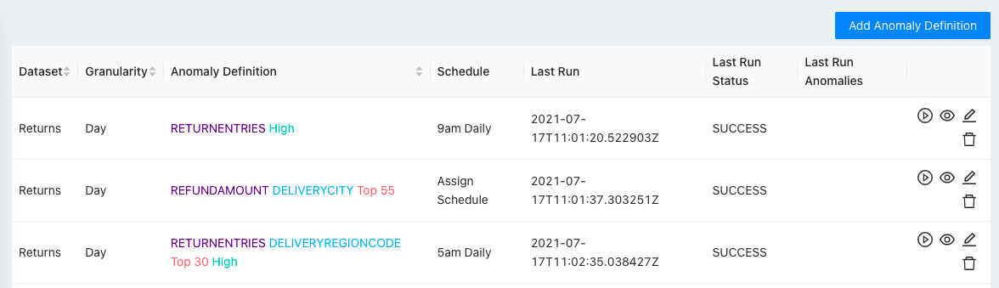

<p align="center">
  <a href="https://cueobserve.cuebook.ai" target="_blank">
    
  </a>
</p>
<p align="center">
  <a href="https://codeclimate.com/github/cuebook/CueObserve/maintainability"></a>
  <a href="https://codeclimate.com/github/cuebook/CueObserve/test_coverage"></a>
  <a href="https://github.com/cuebook/cueobserve/actions/workflows/pr_checks.yml">
    
  </a>
  <a href="https://github.com/cuebook/cueobserve/blob/main/LICENSE.md">
    
  </a>
</p>
<br>

With CueObserve, you can run anomaly detection on data in your SQL data warehouses and databases.


## Getting Started
Install via Docker

```
docker run -p 3000:80 cuebook/cueobserve
```
Now visit [http://localhost:3000](http://localhost:3000) in your browser. 

## How it works
You write a SQL GROUP BY query, map its columns as dimensions and measures, and save it as a virtual Dataset.


You then define one or more anomaly detection jobs on the dataset.



When an anomaly detection job runs, CueObserve does the following:
1. Executes the SQL GROUP BY query on your data warehouse and stores the result as a Pandas dataframe.
2. Generates one or more timeseries from the dataframe, as defined in your anomaly detection job.
3. Generates a forecast for each timeseries using [Prophet](https://github.com/facebook/prophet).
4. Creates a visual card for each timeseries. Marks the card as an anomaly if the last data point is anomalous.

## Features
- Automated SQL to timeseries transformation.
- Run anomaly detection on the aggregate metric or break it down by any dimension.
- In-built Scheduler. CueObserve uses Celery as the executor and celery-beat as the scheduler.
- Slack alerts when anomalies are detected. (coming soon)
- Monitoring. Slack alert when a job fails. CueObserve maintains detailed logs. (coming soon)

### Limitations
- Currently supports Prophet for timeseries forecasting.
- Not being built for real-time anomaly detection on streaming data.

## Support
For general help using CueObserve, read the [documentation](https://cueobserve.cuebook.ai/), or go to [Github Discussions](https://github.com/cuebook/cueobserve/discussions).

To report a bug or request a feature, open an [issue](https://github.com/cuebook/cueobserve/issues).

# Contributing
We'd love contributions to CueObserve. Before you contribute, please first discuss the change you wish to make via an [issue](https://github.com/cuebook/cueobserve/issues) or a [discussion](https://github.com/cuebook/cueobserve/discussions). Contributors are expected to adhere to our [code of conduct](https://github.com/cuebook/cueobserve/blob/main/CODE_OF_CONDUCT.md).
