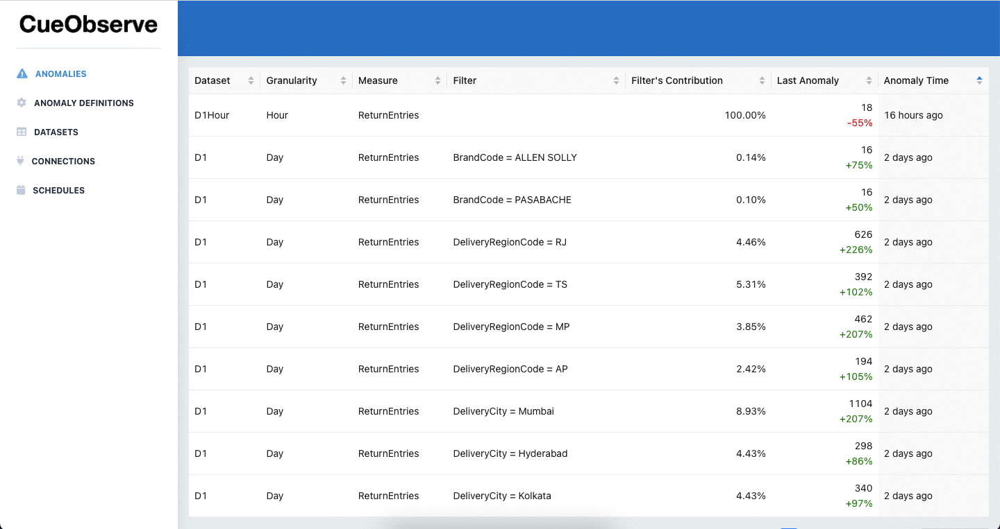
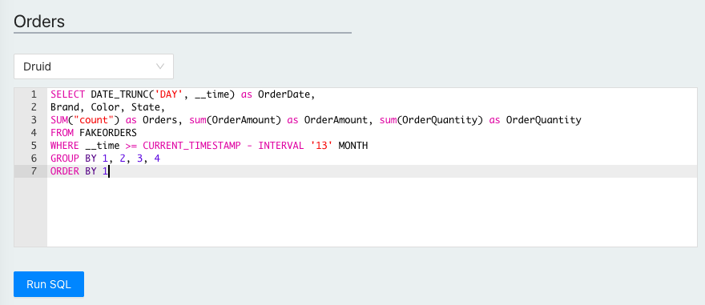
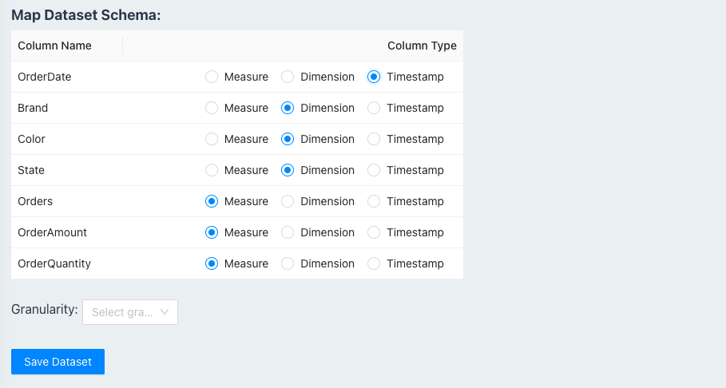

# Overview

With CueObserve, you can run **anomaly detection** on data in your SQL data warehouses and databases. It currently supports Snowflake, BigQuery, Redshift, Druid, Postgres, and MySQL.

## How it works

You write a SQL GROUP BY query, map its columns as dimensions and measures, and save it as a virtual Dataset.

You then define one or more anomaly detection jobs on the dataset.

When an anomaly detection job runs, CueObserve does the following:

1. Executes the SQL GROUP BY query on your datawarehouse and stores the result as a Pandas dataframe.
2. Generates one or more timeseries from the dataframe, as defined in your anomaly detection job.
3. Generates a forecast for each timeseries using [Prophet](https://github.com/facebook/prophet).
4. Creates a visual card for each timeseries. Marks the card as an anomaly if the last data point is anomalous.

## Features

* Automated SQL to timeseries transformation.
* Run anomaly detection on the aggregate metric or break it down by any dimension.
* In-built Scheduler. CueObserve uses Celery as the executor and celery-beat as the scheduler.
* Slack alerts when anomalies are detected
* Monitoring. Slack alert when a job fails. CueObserve maintains detailed logs.

#### Limitations

* Currently supports Prophet for timeseries forecasting.
* Not being built for real-time anomaly detection on streaming data.

## Support

For general help using CueLake, read the documentation, or go to [Github Discussions](https://github.com/cuebook/CueObserve/discussions). To report a bug or request a feature, open a [Github issue](https://github.com/cuebook/CueObserve/issues).

