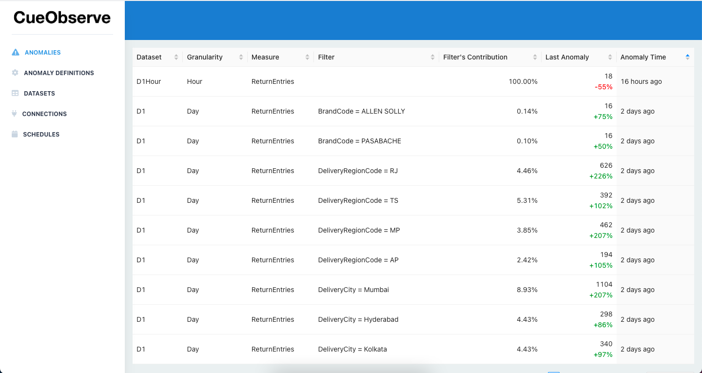

# Anomalies

Anomalies screen lists all published anomalies. Click on a row to view its anomaly card.

Daily anomalies automatically unpublish if there's no anomaly for the next 5 days. Hourly anomalies unpublish after 1 day.

## Anomaly Cards

Anomaly cards follow a template. If you want, you can modify the templates.

