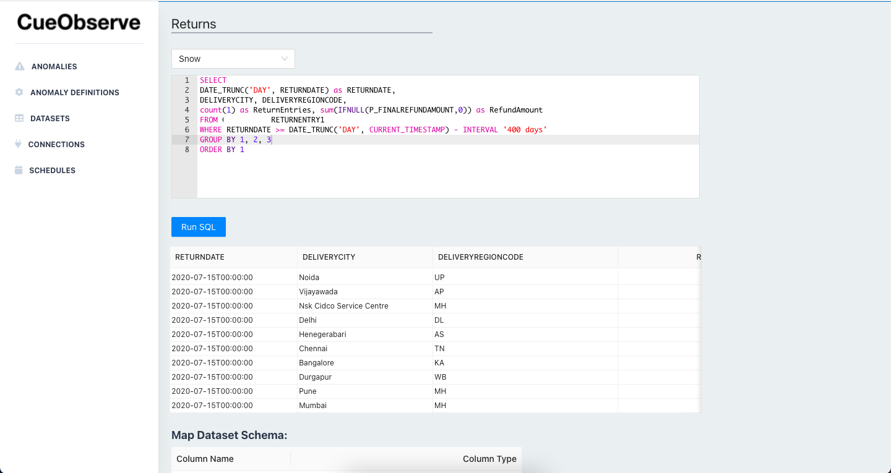
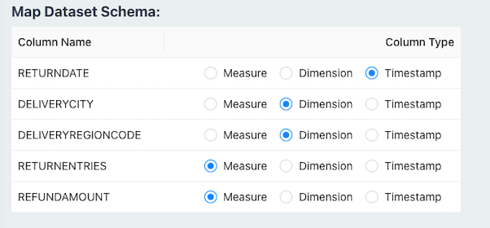

# Datasets

Datasets are similar to aggregated SQL VIEWS of your data. When you run an anomaly detection job, the associated dataset's SQL query is run and the results are stored as a Pandas dataframe in memory.



You write a SQL GROUP BY query with aggregate functions to roll-up your data. You then map the columns as dimensions or measures.



1. Dataset must have only one timestamp column. This timestamp column is used to generate timeseries data for anomaly detection.
2. Dataset must have at least one aggregate column. CueObserve currently supports only COUNT or SUM as aggregate functions. Aggregate columns must be mapped as measures.
3. Dataset can have one or more dimension columns (optional).

## SQL GROUP BY Query

Your SQL must group by timestamp and all dimension columns. You must truncate the timestamp column to HOUR or DAY before grouping. For example, if you want to track hourly anomalies on the dataset, truncate the timestamp to HOUR.

Below is a sample GROUP BY query for BigQuery. See [Data Sources](sources.md) for sample queries on other databases and data warehouses.

```sql
SELECT
TIMESTAMP_TRUNC(CreatedTS, DAY) as OrderDate, -- HOUR or DAY granularity
City, State, -- dimensions
COUNT(1) as Orders, SUM(IFNULL(Order_Amount,0)) as OrderAmount -- measures
FROM ORDERS
WHERE CreatedTS >= TIMESTAMP_SUB(TIMESTAMP_TRUNC(CURRENT_TIMESTAMP(), DAY), INTERVAL 400 DAY)  -- limit historical data to use for forecasting
GROUP BY 1, 2, 3
ORDER BY 1
```

Since the last time bucket might be partial, CueObserve ignores the last time bucket when generating timeseries.
