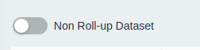

# Datasets

Datasets are similar to aggregated SQL VIEWS of your data. When you run an anomaly detection job, the associated dataset's SQL query is run and the results are stored as a Pandas dataframe in memory.


You write a SQL GROUP BY query with aggregate functions to roll-up your data. You then map the columns as dimensions or measures.


1. Dataset must have only one timestamp column. This timestamp column is used to generate timeseries data for anomaly detection.
2. Dataset must have at least one aggregate column. CueObserve currently supports only COUNT or SUM as aggregate functions. Aggregate columns must be mapped as measures.
3. Dataset can have one or more dimension columns (optional).
4. Dataset can be classified as a non-rollup dataset, details are provided below.

### **Non-Rollup Datasets**

A dataset can be created as a non-rollup dataset using a switch to inform the system that it does not need to roll up aggregate the data during the pre-processing of the data.



By default, all datasets are "rolled up" i.e. metric data points are aggregated(summed up) on the timestamp buckets for a specific dimension value.

But for metrics like percentage etc. such aggregation might not be relevant, so one can specify to the system that it is a non-rollup dataset. Currently we support only single dimension on Non-rollup datasets to avoid duplicate timestamp values after pre-processing.

## SQL GROUP BY Query

Your SQL must group by timestamp and all dimension columns. You must truncate the timestamp column to HOUR or DAY before grouping. For example, if you want to track hourly anomalies on the dataset, truncate the timestamp to HOUR.

Below is a sample GROUP BY query for BigQuery. See [Data Sources](sources.md) for sample queries on other databases and data warehouses.

```sql
SELECT
TIMESTAMP_TRUNC(CreatedTS, DAY) as OrderDate, -- HOUR or DAY granularity
City, State, -- dimensions
COUNT(1) as Orders, SUM(IFNULL(Order_Amount,0)) as OrderAmount -- measures
FROM ORDERS
WHERE CreatedTS >= TIMESTAMP_SUB(TIMESTAMP_TRUNC(CURRENT_TIMESTAMP(), DAY), INTERVAL 400 DAY)  -- limit historical data to use for forecasting
GROUP BY 1, 2, 3
ORDER BY 1
```

Since the last time bucket might be partial, CueObserve ignores the last time bucket when generating timeseries.
