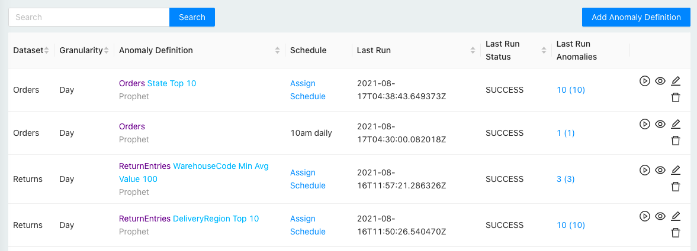

# Getting Started

## Install via Docker

```text
docker run -p 3000:80 cuebook/cueobserve
```

Now visit [localhost:3000](http://localhost:3000) in your browser. 

## Add Connection

Go to the Connections screen to create a connection.


## Add Dataset

Next, create a dataset using your connection. See [Datasets](datasets.md) for details.

## Define and Run Anomaly job

Create an anomaly detection job on your dataset. See [Anomaly Definitions](anomaly-definitions.md) for details.

Once you have created an anomaly job, click on the \`Run\` icon button to trigger the anomaly job. It might take a few seconds for the job to execute.



Once the job is successful, go to the Anomalies screen to view your anomalies.

